# Dr.MicroBit

## Bucles

- controls_repeat_e: Repetir en base a una variable N veces.
    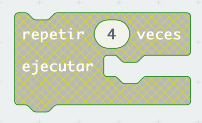

- pxt_controls_for: Bucle en base a un índice.
    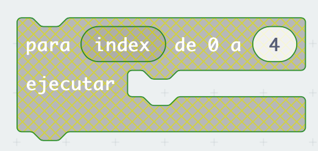
  
- device_while: Bucle while true que permita evaluar una operación lógica.
    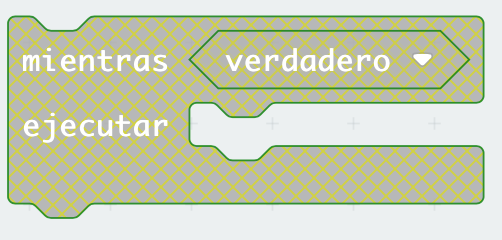

- pxt_controls_for_of: Bucle iterador.
    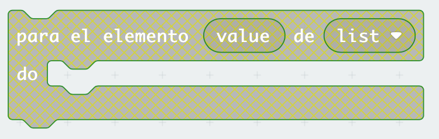

- continue_keyword: Continue para continuar el bucle.

    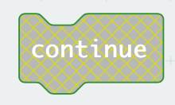

- break_keywor: Break para romper bucle.
  
    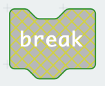

## Lógica

- controls_if: If básico que solo evalua una condición

   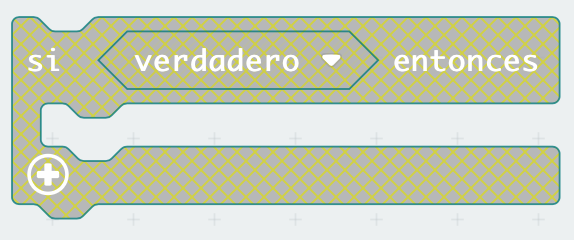

- controls_if (mutation ): If introduciendo `else` y `else if`. Tenemos un numerador que indicandonos la complejidad. `  <mutation elseif="2" else="1" />`

  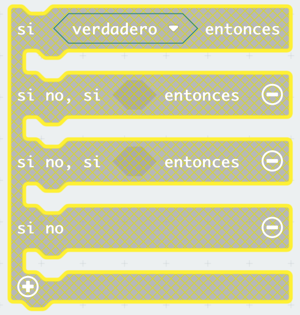

- logic_compare: Comparador lógico. 

  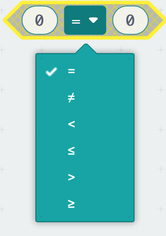

- logic_operation: Operación logica

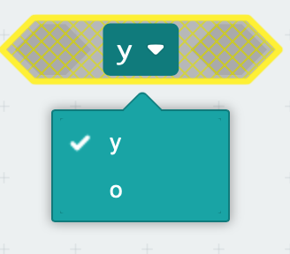

- logic_negate: Negación lógica.

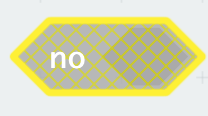

- logic_boolean: Boolean lógico
  
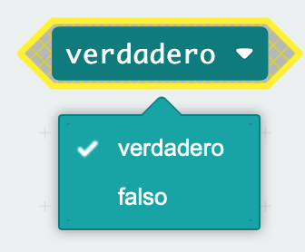